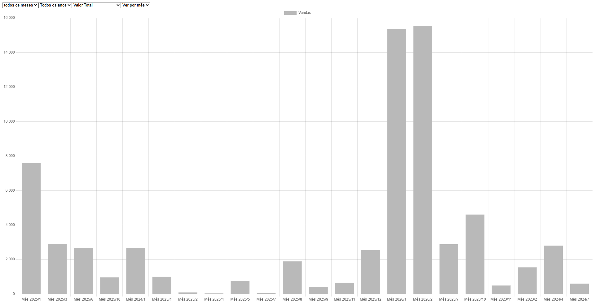
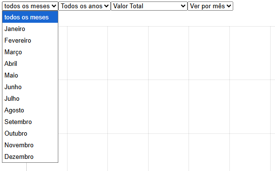
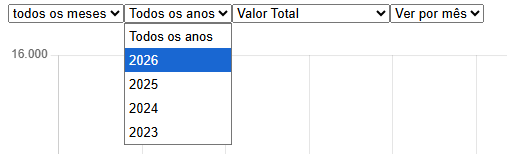
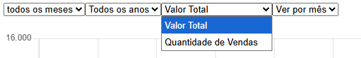
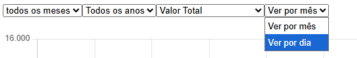
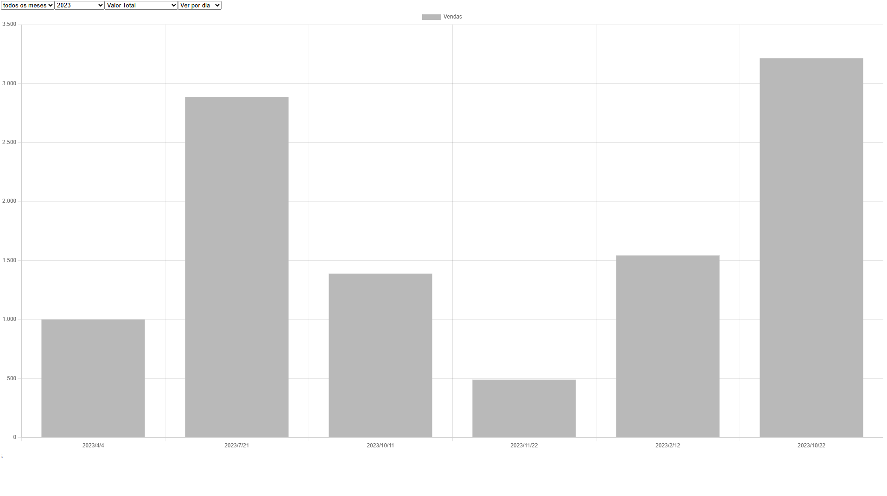
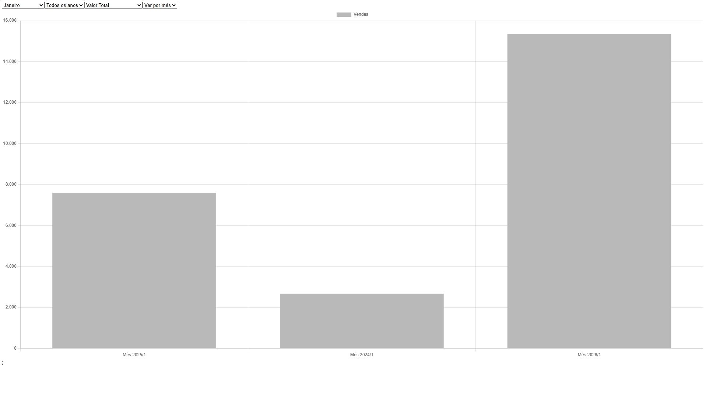
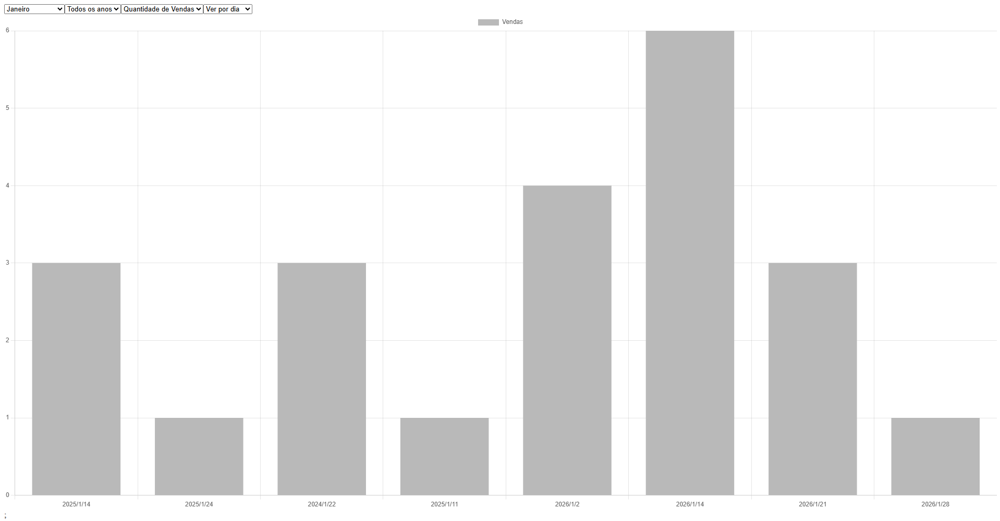

# 📊 Dashboard de Vendas

Este projeto é um dashboard de vendas desenvolvido com React, com o objetivo de visualizar dados de forma dinâmica através de gráficos.

## 🚀 Funcionalidades
- Exibição de vendas em gráfico
- Filtro por período (ano/mês/dia)
- Consumo de API para dados dinâmicos

## 🛠️ Tecnologias utilizadas
- React
- JavaScript
- Chart.js
- HTML

## 🔗 Integração
Este projeto consome dados de uma API própria:

👉 https://github.com/oLuiz1n/api-dashboard-vendas

## ▶️ Como rodar o projeto

```bash
npm install
npm run dev
```

## 📚 Aprendizados

-Consumo de API no front-end
-Manipulação de dados para gráficos em Chart.js
-Organização de componentes em React

## 👨‍💻 Autor

Luiz Gustavo

---

## 📸 Preview:



---

## 🎛️ Filtros:









---

## 📊 Exemplos com Grafico Filtrado: 

    Exemplo 01 - Todos os meses/2023/Valor Total/Ver por dia


---
    Exemplo 02 - Janeiro/Todos os anos/Valor Total/Ver por mês


---
    Exemplo 03 - Janeiro/Todos os anos/Quantidade de Vendas/Ver por dia
